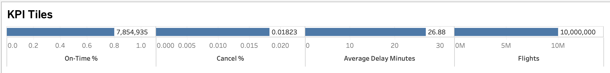
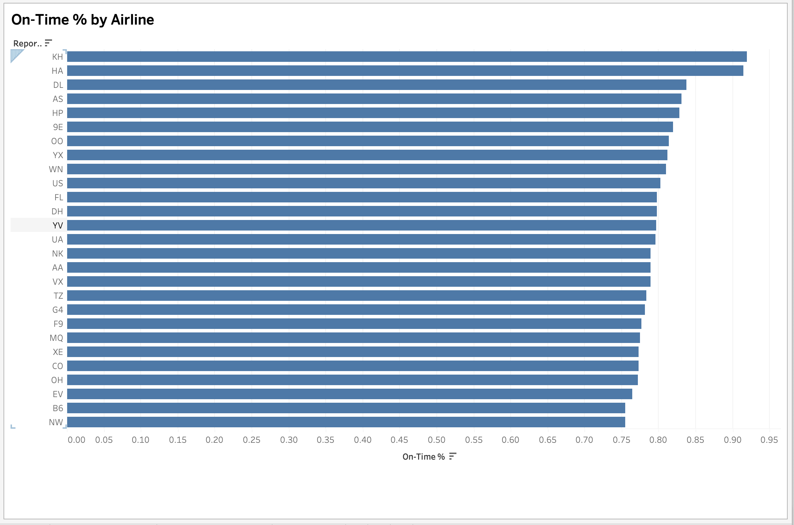
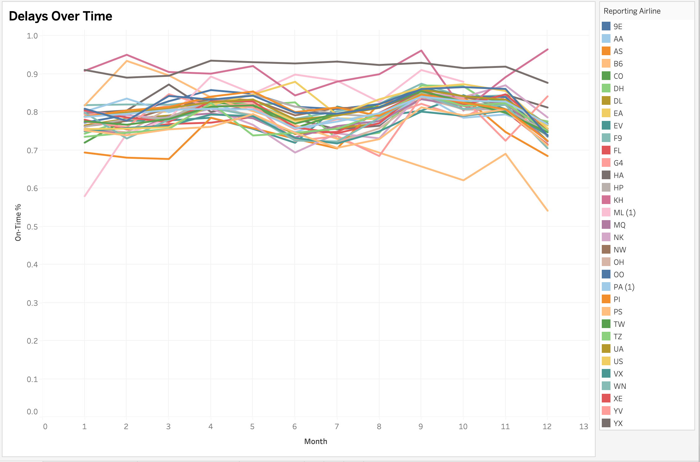
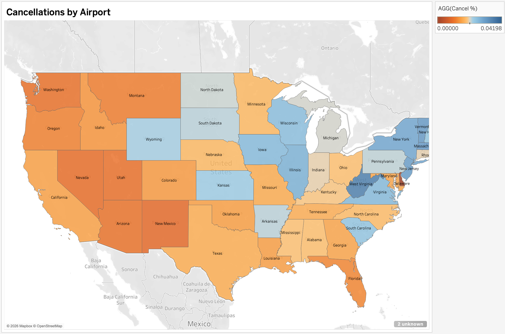
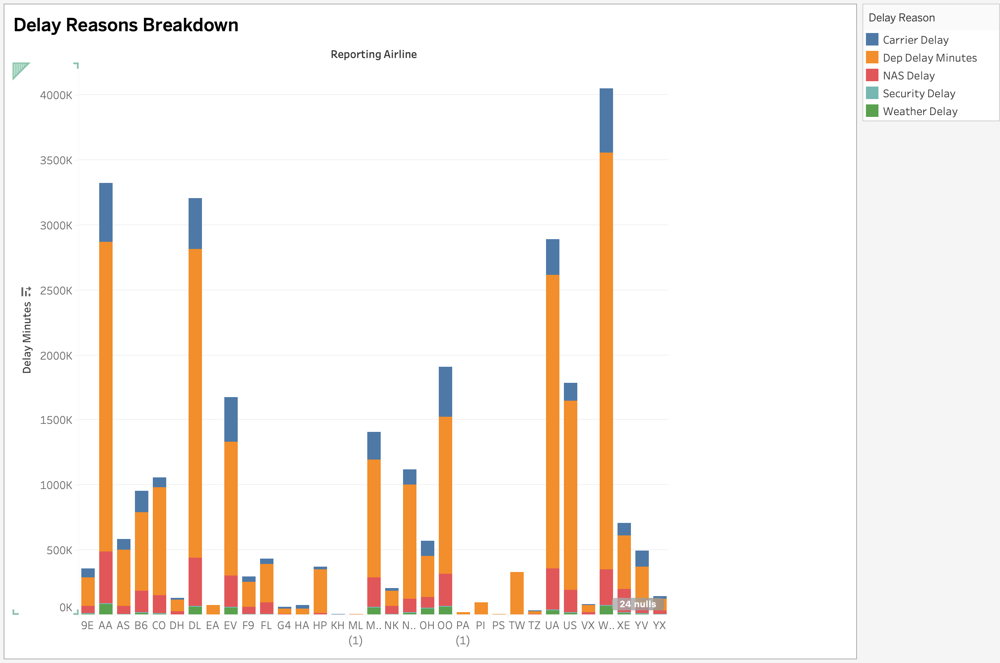

# U.S. Airline Performance Dashboard (2019–2022)

Interactive Tableau dashboard analyzing U.S. airline on-time performance, cancellations, delay trends, and delay causes from 2019–2022.

---

## 📊 Full Dashboard Overview

---

## 🔹 KPI Summary View

This section provides executive-level performance metrics:
- On-Time %
- Cancellation %
- Average Delay Minutes
- Total Flights

Designed for quick operational assessment.

---

## 🔹 Airline Performance Comparison

Compares on-time performance across major airlines, enabling performance benchmarking and competitive analysis.

---

## 🔹 Monthly Trend Analysis

Time-series visualization highlighting seasonal patterns and year-over-year performance changes.

---

## 🔹 Cancellations by State

Geographic analysis of cancellation concentration across states and major airports.

---

## 🔹 Delay Reason Breakdown

Categorical breakdown of delay causes:
- Weather
- Carrier
- NAS (National Airspace System)
- Security
- Late Aircraft

Enables root-cause analysis of operational inefficiencies.

---

## 🎯 Project Objectives

- Transform raw airline performance data into decision-support dashboard
- Identify operational inefficiencies and delay patterns
- Enable interactive filtering for dynamic data exploration
- Deliver executive-style analytical storytelling

---

## 🛠 Tools Used

- Tableau (Dashboard Design & Interactivity)
- Data Cleaning & Aggregation

---

## 📂 Repository Structure

- `/assets/screenshots/` – Dashboard images
- `/reports/` – Project presentation
- Packaged Tableau workbook (.twbx) available upon request (file size exceeds GitHub limits)

---

## 📈 Skills Demonstrated

- KPI Dashboard Design
- Data Visualization Best Practices
- Time-Series Analysis
- Geographic Mapping
- Interactive Business Intelligence Development
- Analytical Storytelling
- Executive Reporting Design

---

## 👤 Author

Muhammad Umer Farooq  
Master’s in Technology Management (Data Science Concentration)  
LinkedIn: https://www.linkedin.com/in/iammuhammadumer/
